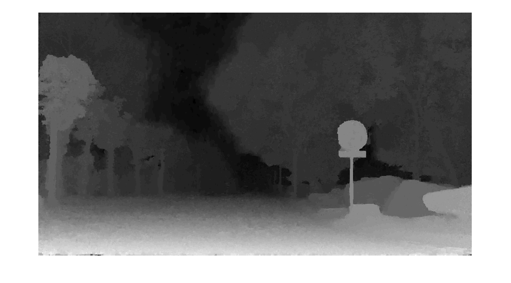

# Depth-from-Video

Implements "Consistent Depth Maps Recovery from a Video Sequence"

http://www.cad.zju.edu.cn/home/bao/pub/Consistent_Depth_Maps_Recovery_from_a_Video_Sequence.pdf

Part3.m extracts depth from stereo using unrectified images

Part4.m extracts depth from video frames

